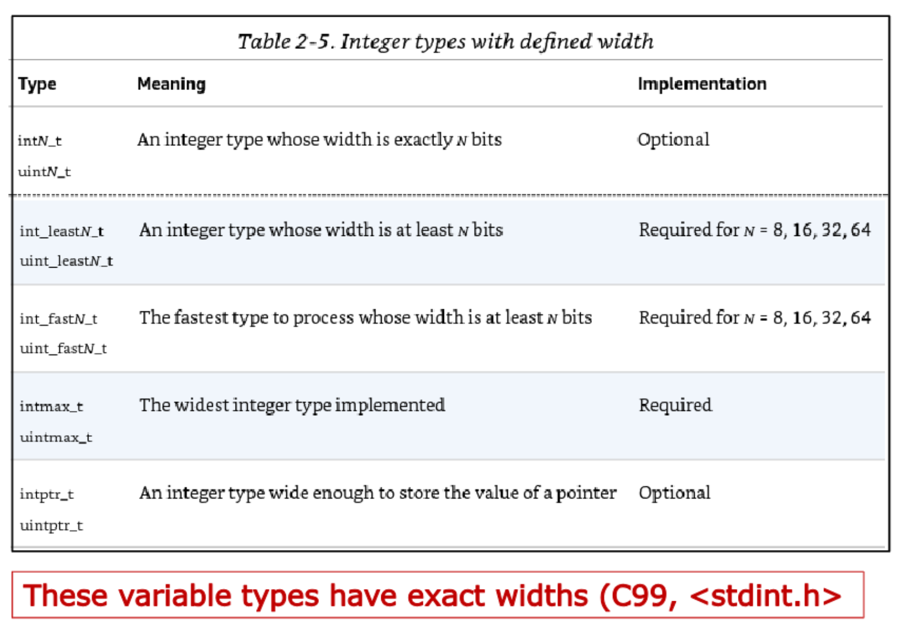

# Wednesday, the 2nd of October 2024

**Note on arrays:** Arrays are always passed by reference since they're usually treated as a pointer to the starting index

Notable differences between arrays and pointers
```C
int *p;
int *arr[10];
sizeof(*p) //size of apointer
sizeof(arr) //size of all elements in array

typedef struct {
    int length;
    int line_as_array[1000];
    int* line_as_pointer;
} Line;

void do_something_with_line(Line line) {
    line.line_as_a_pointer = 0;
    line.line_as_an_array = 0
}

void main() {
    Line my_line;
    my_line.length = 20;
    my_line.line_as_a_pointer = (int*) callloc(my_line.length, sizeof(int));

    my_line.line_as_pointer[0] = 10;
    my_line_line_as_array[0] = 10;

    do_something_with_line(my_line)

    printf("%d %d\n", my_line.line_as_pointer[0], my_line.line_as_array[0]);
    //output: 0 10
    //the pointer is passed by value and the value is edited
    //the array is passed by ref so changes are saved outside of the function scope
}
```

Changing bases:
```C
#include <stdio.h>
int main() {
    const int N = 1234;

    printf("Decimal:    %d\n", N);
    printf("Hex:    %x\n", N);
    printf("Octal   %o\n", N);
    
    printf("Literals (not supported by all compilers):\n",);
    printf("0x4d2       = %d (hex)\n", 0x4d2);
    printf("0b10011010010   = %d (binary)\n",0b10011010010);
    printf("02322       = %d (octal, prefix 0 - zero)\n", 02322);
}
```
Output:
```
Output Decimal: 1234
Hex: 4d2
Octal: 2322
Literals (not supported by all compilers):
0x4d2 = 1234 (hex)
0b10011010010 = 1234 (binary)
02322 = 1234 (octal, prefix 0 - zero)
```

### Twos Complement
$$A=a_{N-1}(-2^{N-1})\sum_{i=0}^{N-2}(a_i+2i)$$
********
- msb (most significant bit) has weight of $-2^N-1$

- Most positive 4-bit number: 0111
- Most negative 4-bit number: 1000
- The most significant bit still indicates the sign (1 = negative, 0 = positive)
  - Range of an N-bit two's complement number: [$-2^{N-1}...2^{N-1}-1$]

Converting from decimal to twos compliment:
-31
convert to binary
negative 0001 1111
if negative flip bits else you're done
1110 0000
and add one
1110 0001

Converting from two's compliment to decimal:
**1**110 0001
note msb and flip the bits
0001 1110
add 1
0001 1111
convert binary 
31
add sign from msg
**-31**


**More on C programming:**
- all variables must be defined before used (not required to be initialized/declared)
- All variables are private to the specific function scope they're declared in unless used with the keyword static
- Using static causes the value to persist between calls
    - good idea to use a static initialized bool if you're using a static integer that is incremented to prevent re declaration

Integer Variables With consistent size across platforms:
