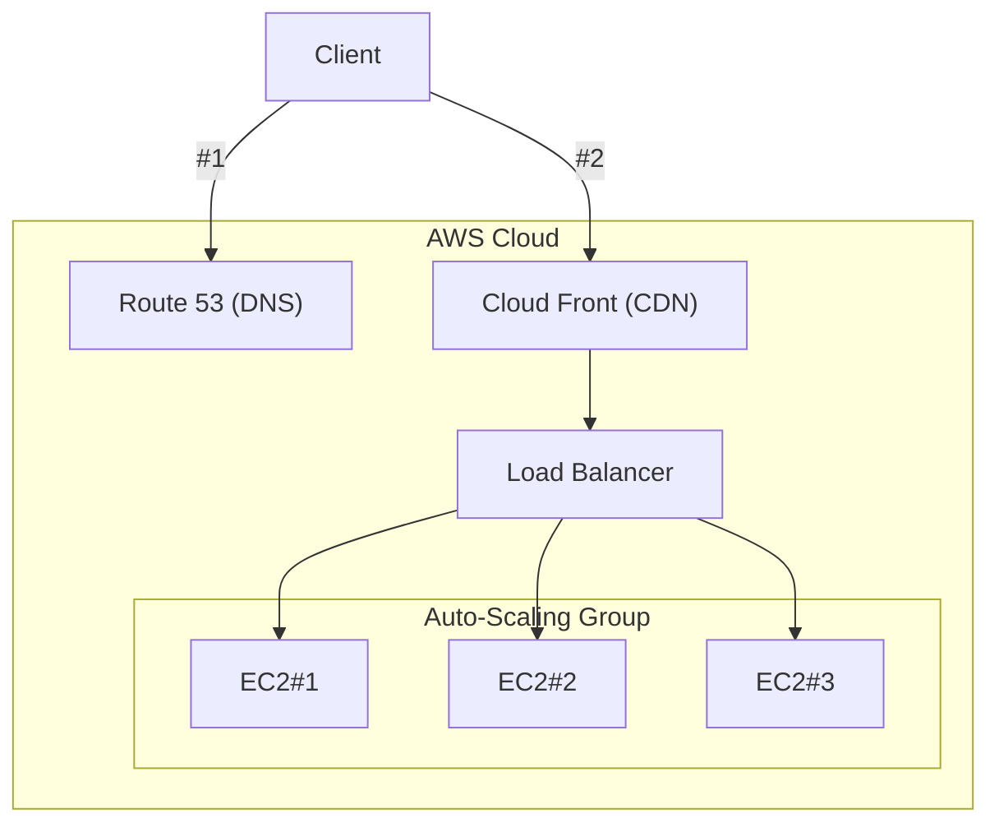

# Monday, the 25th of November 2024

# Binary Trees Wrap Up and Binary Search Trees

Nadah

# Git and GitHub
1. Declare folder as a git repo: `git init {repo_name}`
2. Make changes to code/add files
3. Stages files to be commited: `git add {file_names}`
    - file_names = `.` will add all files in the repo that have changed.
4. `git commit -m "{commit_message}"`
5. Show merge state and othr anomallys: `git status`
6. Submit changes to repo: `git push origin {destination_branch}`

More commands
- `git diff `

### Load-Balancing

A load balancer acts as an entry point to your scalable resources; spreading the incoming traffic though your dynamic groups.

